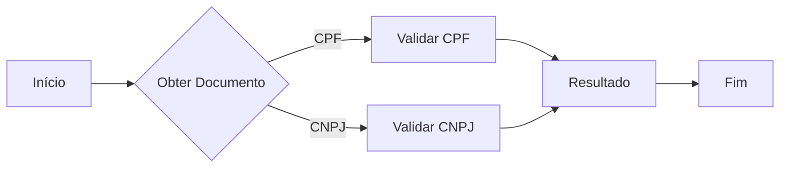

# Validador de CPF e CNPJ

Este script Python valida CPFs e CNPJs.

## Dependências

Não há dependências externas.

## Uso

1. Execute o script.
2. Digite o CPF ou CNPJ quando solicitado.
3. O script informará se o documento é válido ou inválido.

## Fluxo Funcional



## Exemplos

```
Digite o CPF ou CNPJ: 12345678901
CPF válido

Digite o CPF ou CNPJ: 12345678000199
CNPJ válido
``` 
